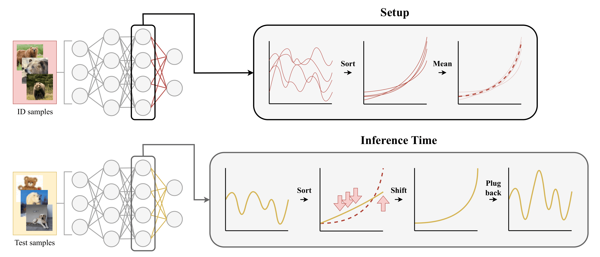

# Ranked Activation Shift for Out-of-Distribution Detection 📈
This is the source code for the paper "Ranked Activation Shift for Out-of-Distribution Detection" by Gianluca Guglielmo and Marc Masana.

The paper introduces RAS, a novel score-enhancing OoD detection method that is easy to use, hyperparameter-free and requires no assumptions on the model architecture.

<p align="center">
    
    <br>
    <em>Visual intuition of RAS.</em>
</p>

---

## 🎯 Motivation

In many real-world applications, neural networks may encounter data that do not belong to the distribution on which they were trained. Detecting such OoD samples is critical to prevent unsafe decisions in areas such as autonomous driving, healthcare, or finance.

---

## 📌 Overview

This toy example uses:
- **CIFAR-10, CIFAR-100, ImageNet200, ImageNet** as in-distribution (ID) datasets.
- **ResNet18** (with pretrained weights) as the backbone.

The script stores feature vectors from each sample and applies RAS to them. It then computes the AUROC score per layer.

After running the script, you will obtain a **bar plot** with the AUROC calculated for each layer of the model. The **dotted line** indicates the AUROC of the final layer. Green layers are the ones that beat the final layer.

---

## 🚀 How to Run

### 📦 Requirements

- Python 3.10+
- CUDA-capable GPU (recommended)

Install the dependencies:

```bash
pip install -r requirements.txt
```

### 📂 Datasets

**CIFAR-10, CIFAR-100, and ImageNet-200** datasets (along with their OoD counterparts) are downloaded automatically by the OpenOOD benchmark when you first run the script. No manual setup is needed.

**ImageNet-1K** requires manual preparation because the Google Drive download from OpenOOD may fail due to file size and quota limits. To set it up:

1. Download the OpenOOD `imagenet_1k` archive from [Google Drive](https://drive.google.com/uc?id=1i1ipLDFARR-JZ9argXd2-0a6DXwVhXEj) (you may need to request access).
2. Extract it into `data/images_largescale/imagenet_1k/`.
3. You also need the OoD datasets for the ImageNet benchmark (`ssb_hard`, `ninco`, `inaturalist`, `texture`, `openimage_o`, `imagenet_v2`, `imagenet_c`, `imagenet_r`). These are downloaded automatically if not already present.

The expected directory structure after setup:

```
data/
├── benchmark_imglist/       # auto-downloaded
├── images_classic/          # auto-downloaded (CIFAR, SVHN, MNIST, ...)
│   ├── cifar10/
│   ├── cifar100/
│   ├── ...
└── images_largescale/       # auto-downloaded (except imagenet_1k)
    ├── imagenet_1k/
    ├── ssb_hard/
    ├── ...
```

### ▶ Running the Script

Run all experiments (CIFAR-10, CIFAR-100, ImageNet-200, ImageNet):

```bash
python run_ras.py
```

Run a single dataset:

```bash
python run_ras.py --id-data cifar10
python run_ras.py --id-data cifar100
python run_ras.py --id-data imagenet200
python run_ras.py --id-data imagenet
```

Optional arguments:

| Argument | Default | Description |
|---|---|---|
| `--id-data` | `all` | Which ID dataset to evaluate (`cifar10`, `cifar100`, `imagenet200`, `imagenet`, or `all`) |
| `--batch-size` | `200` | Batch size for data loaders |

Results are saved as pickle files in the `run_results/` directory.

---

## 📚 References
```bibtex
@inproceedings{guglielmo2026ranked,
  title={Ranked Activation Shift for Post-Hoc Out-of-Distribution Detection},
  author={Guglielmo, Gianluca and Masana, Marc},
  booktitle={European Conference on Computer Vision},
  year={2026},
  organization={Springer}}
```
